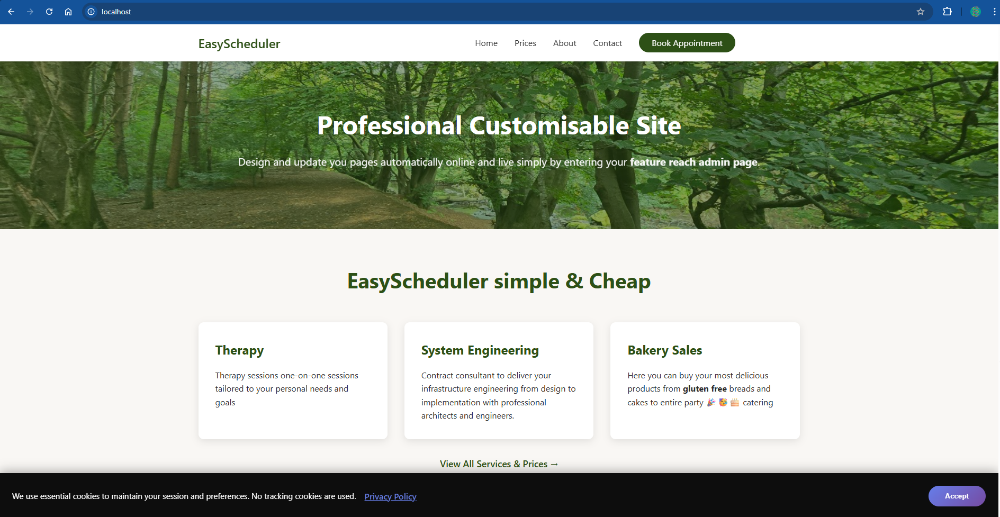
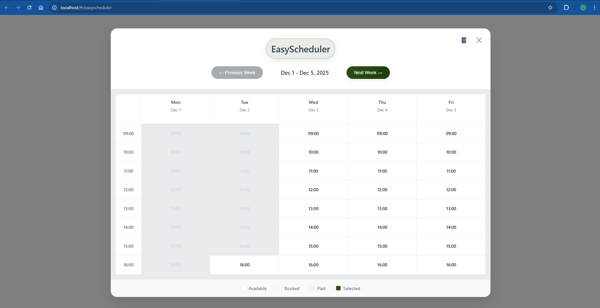
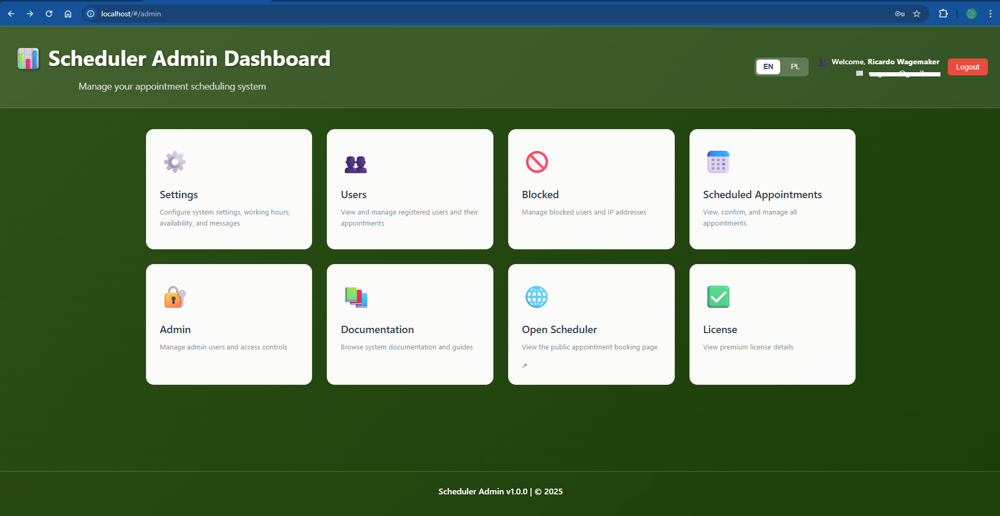
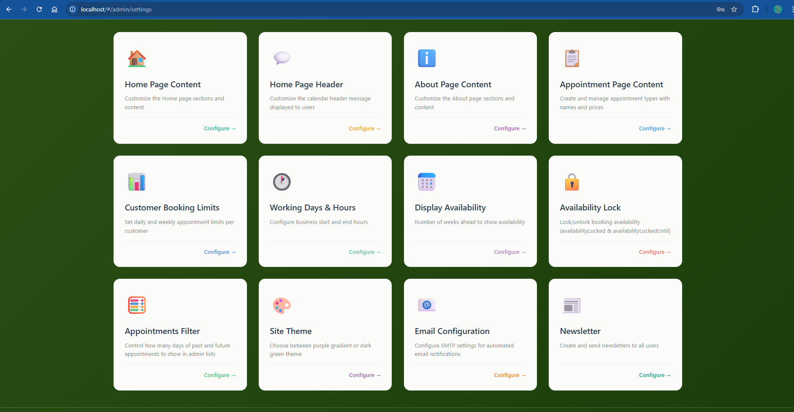
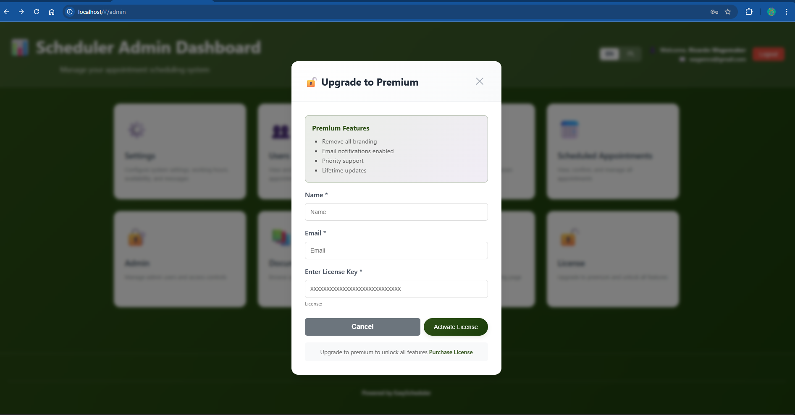

<p align="center">
  
  
  
  
</p>

# 📅 EasyScheduler

**The modern, elegant appointment booking system for professionals who value their time.**

EasyScheduler is a beautifully crafted, full-featured scheduling platform designed for therapists, consultants, coaches, and service professionals. Built with modern web technologies, it offers a seamless experience for both you and your clients.

---

## ✨ Why EasyScheduler?

Managing appointments shouldn't be complicated. EasyScheduler combines powerful functionality with an intuitive interface, giving you everything you need to run your practice efficiently—without the bloat of enterprise solutions or the limitations of basic booking tools.

### 🎯 Built for Professionals

Whether you're a therapist managing sensitive client relationships, a consultant juggling multiple meeting types, or a coach building your practice, EasyScheduler adapts to your workflow. Your clients see a polished, professional booking experience. You get complete control behind the scenes.

---

## 🚀 Key Features

### 📆 Smart Scheduling
- **Weekly calendar view** with intuitive time slot selection
- **Real-time availability** updates—no double bookings
- **Configurable business hours** including weekend availability
- **Customer booking limits** to prevent over-scheduling (daily/weekly caps)
- **Availability lock** to temporarily pause bookings when needed

### 🌐 Multi-Language Support
- **English and Polish** out of the box
- Easy language switching for international clients
- Separate content management for each language
- Fully translated admin interface

### 🎨 Customizable Experience
- **Theme selection**: Choose between elegant Purple Gradient or professional Dark Green
- **Dynamic content management** for Home, About, and Pricing pages
- **Configurable appointment types** with custom pricing, duration, and descriptions
- **Branded header messages** to personalize the booking experience

### 💼 Powerful Admin Dashboard
- **Tile-based interface** for quick access to all settings
- **User management** with appointment history
- **Blocked users/IPs** management for security
- **Appointment filtering** with customizable date ranges
- **Multi-admin support** with secure authentication

### 📧 Communication Tools
- **Email notifications** for bookings, confirmations, and cancellations
- **Newsletter system** with HTML support for client outreach
- **SMTP configuration** for reliable email delivery
- **Customizable email footer** for branding

### 🔒 Security & Privacy
- **JWT-based authentication** for admin access
- **Rate limiting** to prevent abuse
- **GDPR-friendly** user data management
- **Secure cancellation tokens** for appointment management
- **IP blocking** capabilities

### 💎 Premium Features
- **License-based premium tier** for advanced functionality
- **Email notification system** (Premium)
- **Enhanced customization options** (Premium)

---

## 📸 Screenshots

<div align="center">

### 🏠 Home Page
*Beautiful, responsive landing page with customizable content*



---

### 📅 Scheduler
*Intuitive weekly calendar view for easy appointment booking*



---

### 🎛️ Admin Dashboard
*Clean tile-based interface for managing your practice*



---

### ⚙️ Settings
*Comprehensive settings panel for full customization*



---

### 🔑 License Management
*Easy premium license activation and management*



</div>

---

## 🛠️ Quick Start

### Prerequisites
- Docker installed on your system

### Installation

```bash
# Pull the image
docker pull ghcr.io/gcclinux/easyscheduler:latest

# Run the container
docker run --name "easyscheduler" -d -p 80:5000 -v scheduler-data:/app/data ghcr.io/gcclinux/easyscheduler:latest
```

### Access Points
- **Website**: http://localhost
- **Admin Panel**: http://localhost/#/admin
- **Scheduler**: http://localhost/#/easyscheduler

> 📖 For development setup, source installation, and detailed admin documentation, see the [Admin Guide](ADMIN.md).

---

## 🏗️ Tech Stack

| Layer | Technology |
|-------|------------|
| **Frontend** | React 19, Vite 7, React Router 7 |
| **Backend** | Node.js, Express, TypeScript |
| **Database** | SQLite (default), MongoDB (optional) |
| **Styling** | CSS with CSS Variables for theming |
| **i18n** | i18next for internationalization |
| **Email** | Nodemailer with SMTP support |

---

---

## 🤝 Contributing

Contributions are welcome! Whether it's bug fixes, new features, or documentation improvements, feel free to open an issue or submit a pull request.

---

## 📄 License

This project is licensed under the MIT License - see the [LICENSE](LICENSE) file for details.

---

## 🙏 Acknowledgments

Built with ❤️ for professionals who believe that scheduling should be simple, elegant, and effective.

---

<p align="center">
  <strong>Ready to transform how you manage appointments?</strong><br>
  <a href="ADMIN.md">Get Started with the Admin Guide →</a>
</p>
